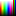
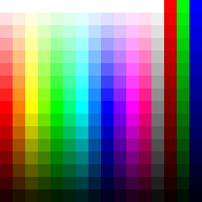

# HSL to RGB

12 Hues + Brown + Monochrome

## 16x16

## 256x256

## Hues

|       0°|      30°|      60°|      90°|     120°|     150°|     180°|     210°|     240°|     270°|     300°|     330°|
|--------:|--------:|--------:|--------:|--------:|--------:|--------:|--------:|--------:|--------:|--------:|--------:|
| Red     | Orange  | Yellow  |Chartreuse|Green   | Spring  | Azure   | Cyan    | Blue    | Violet  | Magenta | Rose    |
|`#FFFFFF`|`#FFFFFF`|`#FFFFFF`|`#FFFFFF`|`#FFFFFF`|`#FFFFFF`|`#FFFFFF`|`#FFFFFF`|`#FFFFFF`|`#FFFFFF`|`#FFFFFF`|`#FFFFFF`|
|`#FFDFDF`|`#FFEFDF`|`#FFFFDF`|`#EFFFDF`|`#DFFFDF`|`#DFFFEF`|`#DFFFFF`|`#DFEFFF`|`#DFDFFF`|`#EFDFFF`|`#FFDFFF`|`#FFDFEF`|
|`#FFBFBF`|`#FFDFBF`|`#FFFFBF`|`#DFFFBF`|`#BFFFBF`|`#BFFFDF`|`#BFFFFF`|`#BFDFFF`|`#BFBFFF`|`#DFBFFF`|`#FFBFFF`|`#FFBFDF`|
|`#FF9F9F`|`#FFCF9F`|`#FEFF9F`|`#CFFF9F`|`#9FFF9F`|`#9FFFCF`|`#9FFFFE`|`#9FCFFF`|`#9F9FFF`|`#CF9FFF`|`#FF9FFE`|`#FF9FCF`|
|`#FF7F7F`|`#FFBF7F`|`#FEFF7F`|`#BFFF7F`|`#7FFF7F`|`#7FFFBF`|`#7FFFFE`|`#7FBFFF`|`#7F7FFF`|`#BF7FFF`|`#FF7FFE`|`#FF7FBF`|
|`#FF5F5F`|`#FFAF5F`|`#FEFF5F`|`#AFFF5F`|`#5FFF5F`|`#5FFFAF`|`#5FFFFE`|`#5FAFFF`|`#5F5FFF`|`#AF5FFF`|`#FF5FFE`|`#FF5FAF`|
|`#FF3F3F`|`#FF9F3F`|`#FEFF3F`|`#9FFF3F`|`#3FFF3F`|`#3FFF9F`|`#3FFFFE`|`#3F9FFF`|`#3F3FFF`|`#9F3FFF`|`#FF3FFE`|`#FF3F9F`|
|`#FF1F1F`|`#FF8F1F`|`#FEFF1F`|`#8FFF1F`|`#1FFF1F`|`#1FFF8F`|`#1FFFFE`|`#1F8FFF`|`#1F1FFF`|`#8F1FFF`|`#FF1FFE`|`#FF1F8F`|
|`#FF0000`|`#FF7F00`|`#FEFF00`|`#7FFF00`|`#00FF00`|`#00FF7F`|`#00FFFE`|`#007FFF`|`#0000FF`|`#7F00FF`|`#FF00FE`|`#FF007F`|
|`#DF0000`|`#DF6F00`|`#DFDF00`|`#6FDF00`|`#00DF00`|`#00DF6F`|`#00DFDF`|`#006FDF`|`#0000DF`|`#6F00DF`|`#DF00DF`|`#DF006F`|
|`#BF0000`|`#BF5F00`|`#BFBF00`|`#5FBF00`|`#00BF00`|`#00BF5F`|`#00BFBF`|`#005FBF`|`#0000BF`|`#5F00BF`|`#BF00BF`|`#BF005F`|
|`#9F0000`|`#9F4F00`|`#9F9F00`|`#4F9F00`|`#009F00`|`#009F4F`|`#009F9F`|`#004F9F`|`#00009F`|`#4F009F`|`#9F009F`|`#9F004F`|
|`#7F0000`|`#7F3F00`|`#7F7F00`|`#3F7F00`|`#007F00`|`#007F3F`|`#007F7F`|`#003F7F`|`#00007F`|`#3F007F`|`#7F007F`|`#7F003F`|
|`#5F0000`|`#5F2F00`|`#5F5F00`|`#2F5F00`|`#005F00`|`#005F2F`|`#005F5F`|`#002F5F`|`#00005F`|`#2F005F`|`#5F005F`|`#5F002F`|
|`#3F0000`|`#3F1F00`|`#3F3F00`|`#1F3F00`|`#003F00`|`#003F1F`|`#003F3F`|`#001F3F`|`#00003F`|`#1F003F`|`#3F003F`|`#3F001F`|
|`#1F0000`|`#1F0F00`|`#1F1F00`|`#0F1F00`|`#001F00`|`#001F0F`|`#001F1F`|`#000F1F`|`#00001F`|`#0F001F`|`#1F001F`|`#1F000F`|
|`#000000`|`#000000`|`#000000`|`#000000`|`#000000`|`#000000`|`#000000`|`#000000`|`#000000`|`#000000`|`#000000`|`#000000`|
| Red     | Orange  | Yellow  |Chartreuse|Green   | Spring  | Azure   | Cyan    | Blue    | Violet  | Magenta | Rose    |

Note:

* Brown is 24°

## Monochrome

| Grey    | Dec |
|--------:|----:|
|`#FFFFFF`| 255 |
|`#EFEFEF`| 239 |
|`#DFDFDF`| 223 |
|`#CFCFCF`| 207 |
|`#BFBFBF`| 191 |
|`#AFAFAF`| 175 |
|`#9F9F9F`| 159 |
|`#8F8F8F`| 143 |
|`#7F7F7F`| 127 |
|`#6F6F6F`| 111 |
|`#5F5F5F`|  95 |
|`#4F4F4F`|  79 |
|`#3F3F3F`|  63 |
|`#2F2F2F`|  47 |
|`#1F1F1F`|  31 |
|`#0F0F0F`|  15 |
|`#000000`|   0 |

## Primary

| Red     | Green   | Blue    |
|--------:|--------:|--------:|
|`#FF0000`|`#00FF00`|`#0000FF`|
|`#EF0000`|`#00EF00`|`#0000EF`|
|`#DF0000`|`#00DF00`|`#0000DF`|
|`#CF0000`|`#00CF00`|`#0000CF`|
|`#BF0000`|`#00BF00`|`#0000BF`|
|`#AF0000`|`#00AF00`|`#0000AF`|
|`#9F0000`|`#009F00`|`#00009F`|
|`#8F0000`|`#008F00`|`#00008F`|
|`#7F0000`|`#007F00`|`#00007F`|
|`#6F0000`|`#006F00`|`#00006F`|
|`#5F0000`|`#005F00`|`#00005F`|
|`#4F0000`|`#004F00`|`#00004F`|
|`#3F0000`|`#003F00`|`#00003F`|
|`#2F0000`|`#002F00`|`#00002F`|
|`#1F0000`|`#001F00`|`#00001F`|
|`#0F0000`|`#000F00`|`#00000F`|
|`#000000`|`#000000`|`#000000`|

